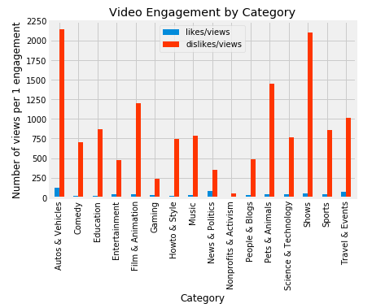
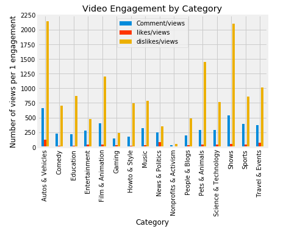

# Youtube Video Analysis
## Background

Here we set out analyzing trending YouTube videos in the U.S., created by the YouTube API. The term “trending” is based on a daily algorithm that scans short term activity regarding views, comments, likes, dislikes, and shares. The data source was from Kaggle.

## Hypothesis

* Viewers are more likely to comment on a negative video, therefore, videos with higher dislikes per views will also have a higher number of comments per view
## Null Hypothesis:

Viewers are not more likely to comment on a negative video, therefore, videos with higher dislikes per views will not have a higher number of comments per view

## Analysis
We could not conclude a relationship between trending Video views and Video Engagement. Obviously trending videos are not a gauge of video popularity and therefore likes and dislikes is not an accurate determinant of the basis of why it is trending. Views determine whether the video is trending or not , likes dislikes and comments are bilateral results of views

## Steps Involved

### Extract 
The data came from two source . A CSV that contained over 40,000 trending videos and a JSON file that has the associated category ID tag for video genre. We had a nested dict and we used json_normalise to get the needed data from the json file. We use panda read_csv to read the CSV file

### Transform 

We want to understand the impact of engagements with a video (likes, dislikes, and comments). To do this we needed to account for video views so adjust information on a per view basis.
We combined the data from two sources in pandas using pd.merge . We did transformations to get the publish date and trending date in the date format. We filtered the columns that were needed for our analysis. Though the dates are not used in the analysis, it is for future work. No duplicates were dropped because this is daily statistics of trending videos and duplicates were necessary to account for all information.

### Load 
 We used MySQL to store the Merged data (source combined data) and the Analytics table. We created the table with utf8mb4 encoding to hold the Merged data, so the different encoding for title field could be handled. We also stored the data to Mongo DB as an option of using our information in a Non-Relational database.

   

## Steps to Run 

### Prerequisite: 
Run mongod Also do pip install flask_table

* Run Youtube_db.sql- Sqlscript 
* Run YoutubeEtl.ipynb- Data read cleanse and load 
* Run visuals.ipynb- Data visualisations 
* Run python app.py 
* Then in the browser launch localhost:5000

### Tools used
 Pandas, MYSQL, Mongodb, Matplotlib, HTML, Flask, CSS
